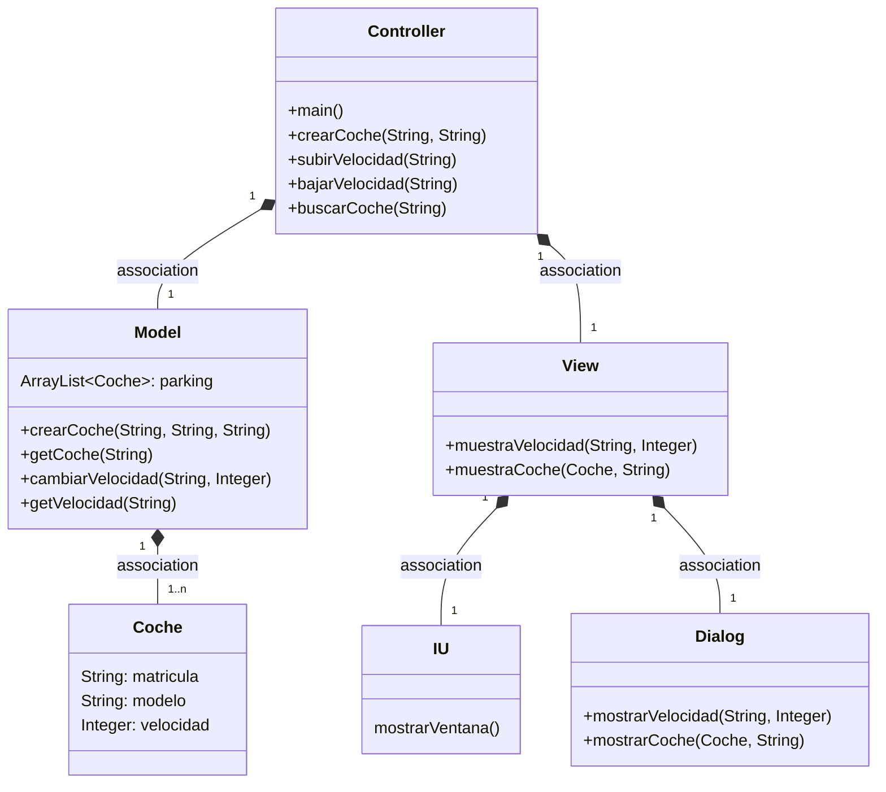
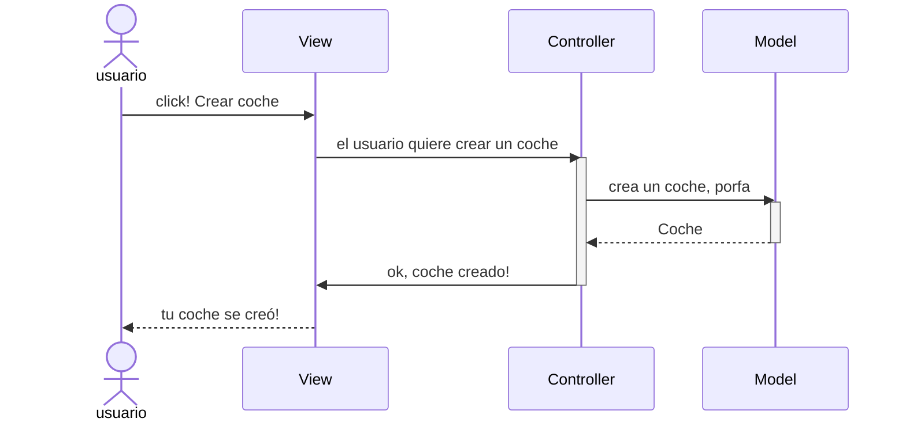
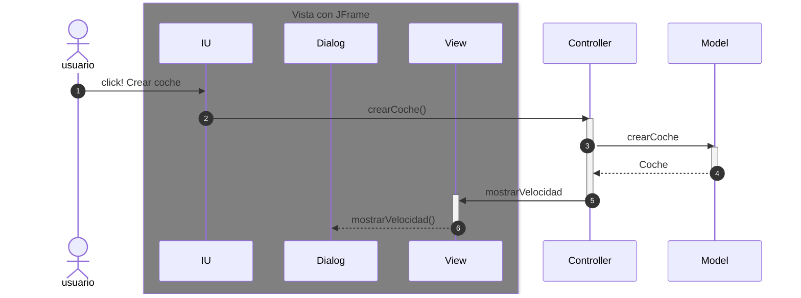
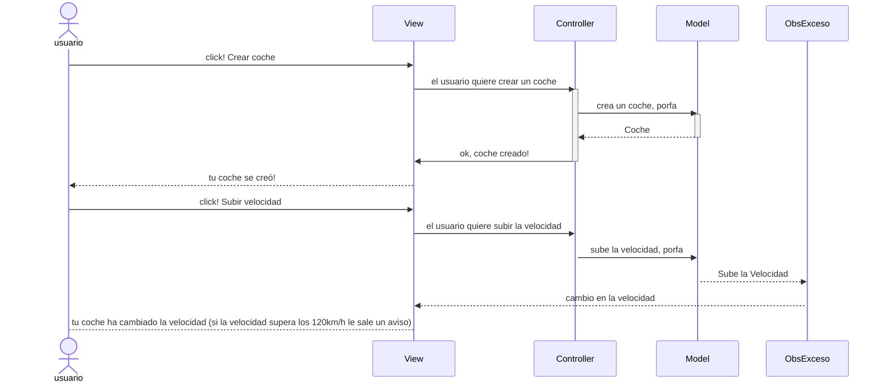
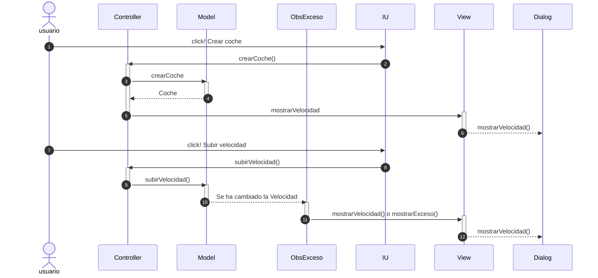

# Arquitectura MVC

Aplicación que trabaja con objetos coches, modifica la velocidad y la muestra, tambien con la posibilidad de mostrar el coche al completo y 
se ha añadido eventos

---
### Diagrama de clases:

---

## Evento en el View

Cuando ocurre algo en la vista, el `controller` se tiene que enterar.
En el MVS la vista no se comunica con el modelo.

En el listener del botón llamamos al `controller` y este llama primero al `model` y al recibir los datos del model llama a la vista `view`.

Pasa lo mismo con los métodos subir velocidad, bajar velocidad y ver coche pero cambiando el texto por el respectivo de esos métodos.

Ahora la parte de la Arquitectura de la vista, son tres clases:

---
## Evento en la Vista con el Observer
Este sería el diagrama de secuencias explicado de forma general

---
## Evento con Observer pero con los nombres de los métodos
De esta manera sería el diagrama de secuencias explicado de forma mas específica

